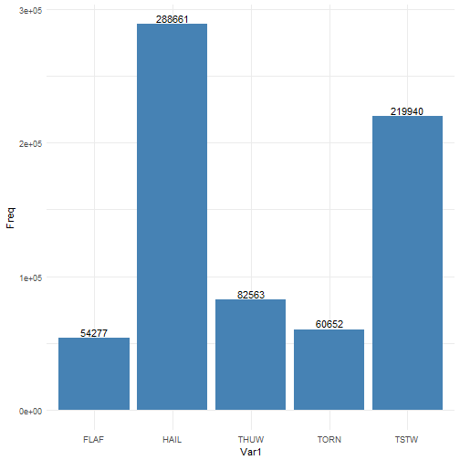
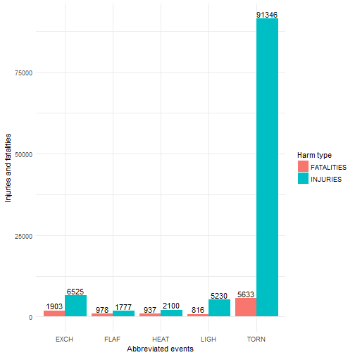
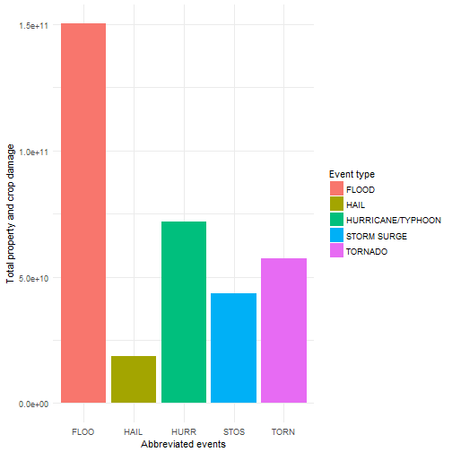

# Analysis of NWS storm data

## Synopsis

Storms and other severe weather events can cause both public health and economic problems for communities and municipalities. Many severe events can result in fatalities, injuries, and property damage, and preventing such outcomes to the extent possible is a key concern.
This analysis paper attempts to garner some insight as to questions such as which types of events are most harmful with respect to population health and which ones have the greatest economic impact. The data analyzed can be found at the [National Weather Service repository](https://d396qusza40orc.cloudfront.net/repdata%2Fdata%2FStormData.csv.bz2) and the documentation for this dataset can be downloaded from [Storm Data documentation](https://d396qusza40orc.cloudfront.net/repdata%2Fpeer2_doc%2Fpd01016005curr.pdf).
In this paper, the data from the above sources will be cleaned and processed and then analyzed by comparing variables and performing cluster analysis.

## Getting the data

### Setting environment data and path

First, the required libraries are loaded into R, which help with processing and analyzing the data.

```r
packages <- c("dplyr", "ggplot2", "reshape2", "tidyr")
sapply(packages, require, character.only = TRUE, quietly = TRUE)
```

```
##    dplyr  ggplot2 reshape2    tidyr 
##     TRUE     TRUE     TRUE     TRUE
```

Path is set to the location on the computer where the files are kept to be analyzed. For reproducibility reasons, this code could be changed if the reader wants to store the files in another location.

```r
setwd("~/Data Science/nws-stormanalysis")
```

### Downloading and unzipping data

This set of code checks whether the `.csv` or `.bz2` files are present in the path directory. If the `.bz2` is not available, this code attempts to download it from the repository link. The link is currently working as of the system time which is outputted below.

```r
# If both the .bz2 and .csv are not found
if (!file.exists("repdata_data_StormData.csv.bz2") && !file.exists("repdata_data_StormData.csv")) {
  url <- "https://d396qusza40orc.cloudfront.net/repdata%2Fdata%2FStormData.csv.bz2"
  download.file(url, file.path(getwd(), "repdata_data_StormData.csv.bz2"))
}

# If the .csv is not found but the .bz2 is present
if (file.exists("repdata_data_StormData.csv.bz2") && !file.exists("repdata_data_StormData.csv")) {
  zipPath <- file.path("C:", "Program Files", "7-Zip", "7z.exe")
  arguments <- c("x")
  f <- "repdata_data_StormData.csv.bz2"
  system(paste0("\"", zipPath, "\" ", arguments, " \"", file.path(getwd(), f), "\""))
}
```

## Data Processing

### Loading the data

The `.csv` file obtained from the repository is then loaded into a variable `nws` in the R global environment.

```r
nws <- tbl_df(read.csv("repdata_data_StormData.csv", na.strings = "", strip.white = TRUE))
```

### Date and time formatting

The dates and times are formatted. This helps plot the variables against time if needed and is generally tidy.


```r
dates <- strsplit(as.character(nws$BGN_DATE), " ")
dates <- sapply(dates, function(x) return(x[1]))
dates <- paste(dates, nws$BGN_TIME)
nws$dates <- as.POSIXct(strptime(dates, "%m/%d/%Y %H%M"))
# rm("dates")
head(nws$dates)
```

```
## [1] "1950-04-18 01:30:00 IST" "1950-04-18 01:45:00 IST"
## [3] "1951-02-20 16:00:00 IST" "1951-06-08 09:00:00 IST"
## [5] "1951-11-15 15:00:00 IST" "1951-11-15 20:00:00 IST"
```

Removing redundant features `BGN_DATE` and `BGN_TIME`, since both the variables have been coerced and combined.


```r
nws <- select(nws, STATE__, dates, TIME_ZONE, COUNTY:REFNUM)
nws
```

```
## # A tibble: 902,297 x 36
##    STATE__ dates               TIME_ZONE COUNTY COUNTYNAME STATE EVTYPE 
##      <dbl> <dttm>              <fct>      <dbl> <fct>      <fct> <fct>  
##  1       1 1950-04-18 01:30:00 CST           97 MOBILE     AL    TORNADO
##  2       1 1950-04-18 01:45:00 CST            3 BALDWIN    AL    TORNADO
##  3       1 1951-02-20 16:00:00 CST           57 FAYETTE    AL    TORNADO
##  4       1 1951-06-08 09:00:00 CST           89 MADISON    AL    TORNADO
##  5       1 1951-11-15 15:00:00 CST           43 CULLMAN    AL    TORNADO
##  6       1 1951-11-15 20:00:00 CST           77 LAUDERDALE AL    TORNADO
##  7       1 1951-11-16 01:00:00 CST            9 BLOUNT     AL    TORNADO
##  8       1 1952-01-22 09:00:00 CST          123 TALLAPOOSA AL    TORNADO
##  9       1 1952-02-13 20:00:00 CST          125 TUSCALOOSA AL    TORNADO
## 10       1 1952-02-13 20:00:00 CST           57 FAYETTE    AL    TORNADO
## # ... with 902,287 more rows, and 29 more variables: BGN_RANGE <dbl>,
## #   BGN_AZI <fct>, BGN_LOCATI <fct>, END_DATE <fct>, END_TIME <fct>,
## #   COUNTY_END <dbl>, COUNTYENDN <lgl>, END_RANGE <dbl>, END_AZI <fct>,
## #   END_LOCATI <fct>, LENGTH <dbl>, WIDTH <dbl>, F <int>, MAG <dbl>,
## #   FATALITIES <dbl>, INJURIES <dbl>, PROPDMG <dbl>, PROPDMGEXP <fct>,
## #   CROPDMG <dbl>, CROPDMGEXP <fct>, WFO <fct>, STATEOFFIC <fct>,
## #   ZONENAMES <fct>, LATITUDE <dbl>, LONGITUDE <dbl>, LATITUDE_E <dbl>,
## #   LONGITUDE_ <dbl>, REMARKS <fct>, REFNUM <dbl>
```

## Results

### Exploratory analysis
By quickly analyzing the variables of the dataset, some variables seem key to our analysis, like `FATALITIES` and `INJURIES`.

```r
names(nws)
```

```
##  [1] "STATE__"    "dates"      "TIME_ZONE"  "COUNTY"     "COUNTYNAME"
##  [6] "STATE"      "EVTYPE"     "BGN_RANGE"  "BGN_AZI"    "BGN_LOCATI"
## [11] "END_DATE"   "END_TIME"   "COUNTY_END" "COUNTYENDN" "END_RANGE" 
## [16] "END_AZI"    "END_LOCATI" "LENGTH"     "WIDTH"      "F"         
## [21] "MAG"        "FATALITIES" "INJURIES"   "PROPDMG"    "PROPDMGEXP"
## [26] "CROPDMG"    "CROPDMGEXP" "WFO"        "STATEOFFIC" "ZONENAMES" 
## [31] "LATITUDE"   "LONGITUDE"  "LATITUDE_E" "LONGITUDE_" "REMARKS"   
## [36] "REFNUM"
```

Now, by looking at the variable `EVTYPE`, the most occuring natural disaster can be found.

```r
occurances <- tbl_df(data.frame(table(nws$EVTYPE)))
arrange(occurances, desc(Freq))
```

```
## # A tibble: 985 x 2
##    Var1                 Freq
##    <fct>               <int>
##  1 HAIL               288661
##  2 TSTM WIND          219940
##  3 THUNDERSTORM WIND   82563
##  4 TORNADO             60652
##  5 FLASH FLOOD         54277
##  6 FLOOD               25326
##  7 THUNDERSTORM WINDS  20843
##  8 HIGH WIND           20212
##  9 LIGHTNING           15754
## 10 HEAVY SNOW          15708
## # ... with 975 more rows
```

Plotting the top five occurances:



### Analyzing events harmful to population health

Now, the variables `FATALITIES` and `INJURIES` are extracted from the data set and sorted.


```r
nws <- group_by(nws, EVTYPE)
summary <- summarize(nws, FATALITIES = sum(FATALITIES), INJURIES = sum(INJURIES))
arrange(summary, desc(FATALITIES), desc(INJURIES))
```

```
## # A tibble: 985 x 3
##    EVTYPE         FATALITIES INJURIES
##    <fct>               <dbl>    <dbl>
##  1 TORNADO              5633    91346
##  2 EXCESSIVE HEAT       1903     6525
##  3 FLASH FLOOD           978     1777
##  4 HEAT                  937     2100
##  5 LIGHTNING             816     5230
##  6 TSTM WIND             504     6957
##  7 FLOOD                 470     6789
##  8 RIP CURRENT           368      232
##  9 HIGH WIND             248     1137
## 10 AVALANCHE             224      170
## # ... with 975 more rows
```

Note how the injuries are skewed in favour of tornadoes.

Plotting the most harmful events.

Here, the size of each bar indicates the amount of fatalities and injuries. Fatalities are colored orange, while injuries are colored turquoise. The name under each bar indicates the abbreviation for each event type.



### Analyzing events harmful to economy

In this section, the variables `PROPDMG` and `CROPDMG` will be analyzed along with their exponents. Note that the values in these variables are broad estimates according to the dataset documentation.

First, the property and crop damages are calculated with respect to their exponents.


```r
propertydmg <- numeric(nrow(nws))

for (i in 1:length(propertydmg)) {
    exp <- as.character(nws$PROPDMGEXP[i])
    damage <- nws$PROPDMG[i]
    if (is.na(exp)) {propertydmg[i] <- damage; next}
    if (exp == "k" | exp == "K") {damage <- damage * 10 ^ 3}
    if (exp == "m" | exp == "M") {damage <- damage * 10 ^ 6}
    if (exp == "b" | exp == "B") {damage <- damage * 10 ^ 9}
    propertydmg[i] <- damage
}

nws$propertydmg <- propertydmg
```


```r
cropdmg <- numeric(nrow(nws))

for (i in 1:length(cropdmg)) {
    exp <- as.character(nws$CROPDMGEXP[i])
    damage <- nws$CROPDMG[i]
    if (is.na(exp)) {cropdmg[i] <- damage; next}
    if (exp == "k" | exp == "K") {damage <- damage * 10 ^ 3}
    if (exp == "m" | exp == "M") {damage <- damage * 10 ^ 6}
    if (exp == "b" | exp == "B") {damage <- damage * 10 ^ 9}
    cropdmg[i] <- damage
}

nws$cropdmg <- cropdmg
```

Adding both the damages together to create total damage in variable `totaldmg`.


```r
nws <- mutate(nws, totaldmg = propertydmg + cropdmg)
nws <- arrange(nws, desc(totaldmg))
summary <- summarize(nws, TOTALDMG = sum(totaldmg))
arrange(summary, desc(TOTALDMG))
```

```
## # A tibble: 985 x 2
##    EVTYPE                 TOTALDMG
##    <fct>                     <dbl>
##  1 FLOOD             150319678257 
##  2 HURRICANE/TYPHOON  71913712800 
##  3 TORNADO            57352114049.
##  4 STORM SURGE        43323541000 
##  5 HAIL               18758221521.
##  6 FLASH FLOOD        17562129167.
##  7 DROUGHT            15018672000 
##  8 HURRICANE          14610229010 
##  9 RIVER FLOOD        10148404500 
## 10 ICE STORM           8967041360 
## # ... with 975 more rows
```

It seems that floods cause the most damage in property, followed by hurricanes and tornadoes.

Plotting the most harmful events.

Here, the five most harmful events to the economy are shown. The height of the bar indicates the total damage to both property and crops. The names under each bar indicate the abbreviation for each event type.



### Conclusion

The following conclusions were made after the following analysis:
- The most common occurance of a disaster are hailstorms followed by thunderstorm winds. Tornadoes and flash floods also occur frequently.
- Tornades are the absolute leaders in terms of harm to population. They are followed by excessive heat and lightning, albeit far ahead.
- In terms of economic damage, floods are the leaders. Hurricanes and tornadoes also cause significant damage to property and crops.


Note that the `echo = FALSE` parameter was added to the code chunk to prevent printing of the R code that generated the plot.
